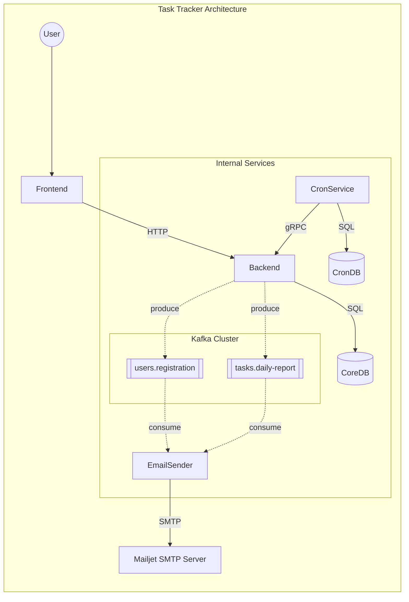

```mermaid
graph TD
%% Основная архитектура
    subgraph System ["Task Tracker Architecture"]
        direction TB
        User((User)) ----> Frontend
        Frontend -- "HTTP" --> Backend

        subgraph Services ["Internal Services"]
            direction TB
            Backend -- "SQL" --> DB[(CoreDB)]
            
            %% Вложенный подграф для Kafka
            subgraph KafkaCluster ["Kafka Cluster"]
                direction LR
                Queue1[[users.registration]]
                Queue2[[tasks.daily-report]]
            end

            Backend -. "produce" .-> Queue1
            Backend -. "produce" .-> Queue2

            CronService -- "gRPC" --> Backend
            CronService -- "SQL" --> CronDb[(CronDB)]

            Queue1 -. "consume" .-> EmailSender
            Queue2 -. "consume" .-> EmailSender
        end

        EmailSender -- "SMTP" --> ExternalSMTP[Mailjet SMTP Server]
    end
```